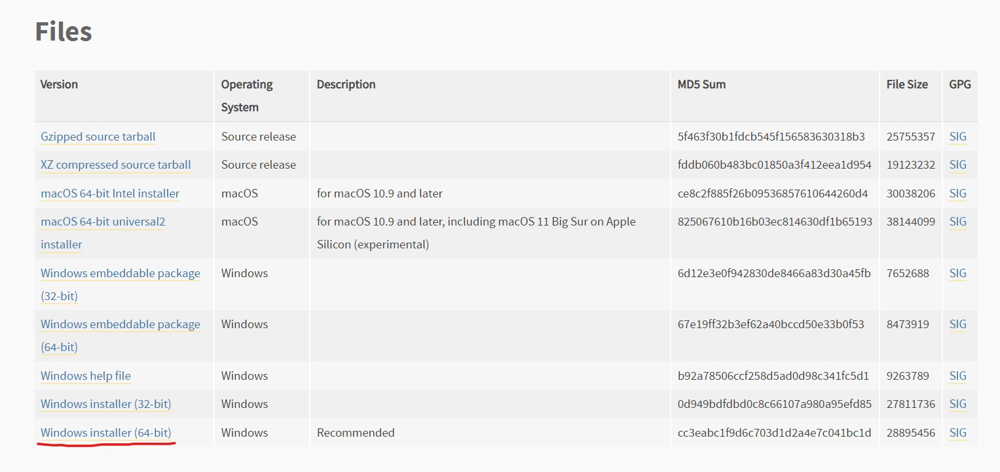

# Python Learning

Python is a interpreted high-level programming language. Python is easy to learn and can do various tasks: Web Application, AI & Machine Learning, Data Analytics, etc.

## Python Installation and Setup for VSCode

1. Open [Python official website](https://www.python.org/).
2. Go to Download section and select installer depended on your OS
   

3. During Installation, you can check Add path checkbox and click install now.
4. check whether python has installed or not

```
python --version
```

5. Install Python extension in VSCode
6. Start coding Python!

## Basics

- has no command for declaring variable data type
- use indent instead of curly bracket
- single comment (#) and multiple comment (""" """)
- string can be declared either by using single or double quotes
- case-sensitive
- no semicolon

### Multiple items Data Type

```py
# List - ordered, changeable, allow duplicate members, allow multiple data types
mylist = ["mouse", "keyboard", "screen", 24, False]

# Tuple - ordered, unchangeable, allow duplicate members, allow multiple data types
myTuple = ("mouse", "keyboard", "screen", 24, False)

# Set - unordered, unchangeable, mo duplicate members, allow multiple data types
mySet = {"mouse", "keyboard", "screen", 24, False}

# Dictionary - ordered, changeable, mo duplicate members
myDict = {
   "name": "Billy",
   "year": 2000
}
```

### Condition

```py
a = 200
b = 33
if b > a:
  print("b is greater than a")
elif a == b:
  print("a and b are equal")
else:
  print("a is greater than b")

# short hand if else
print("a") if a > b else print("b")
```

### Loop

```py
# While Loop
i = 0
while i < 6:
  i += 1
  if i == 3:
    continue
  print(i)

# For Loop
fruits = ["apple", "banana", "cherry"]
for x in fruits:
  if x == "banana":
    break
  print(x)
```

### Function

```py
def showName(name):
   print("Your name: " + name)

showName("Smith")
```

### Classes, Objects and Methods

```py
# defines class
class Person:
  # constructor - initialize value
  def __init__(self, name, age):
    self.name = name
    self.age = age

  def showName(self):
     print("My name is " + self.name)

# create object
p1 = Person("John", 36)

print(p1.name)
print(p1.age)
p1.showName()
```

### Inheritance

```py
class Person:
  def __init__(self, fname, lname):
    self.firstname = fname
    self.lastname = lname

  def printname(self):
    print(self.firstname, self.lastname)

class Student(Person):
  def __init__(self, fname, lname, year):
    super().__init__(fname, lname)
    self.graduationyear = year

  def welcome(self):
    print("Welcome", self.firstname, self.lastname, "to the class of", self.graduationyear)

x = Student("Mike", "Olsen", 2019)
x.welcome()
```

### import

```py
# age.py
def show_age(age):
    return "Your age: " + str(age)

# main.py
import age

person = age.show_age(24)
print(person)
```

### JSON

```py
# Convert JSON to Dict
import json

# some JSON:
x =  '{ "name":"John", "age":30, "city":"New York"}'

# parse x:
y = json.loads(x)

# the result is a Python dictionary:
print(y["age"])
```

```py
# Convert Dict to JSON
import json

# a Python object (dict):
x = {
  "name": "John",
  "age": 30,
  "city": "New York"
}

# convert into JSON:
y = json.dumps(x)

# the result is a JSON string:
print(y)
```

### Python Packages/Libraries/Modules

- pip - package manager for Python packages which enable download other Python packages
- json - convert JSON to Dict and vice versa
- datetime - date
- re - regular expression

## Django (Web Application)
